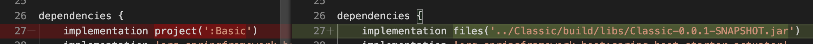

# A Gradle Multi Project Proof Of Concept
a POC for a possible answer to the question [Gradle and Spring-bootRun can not find my class](https://stackoverflow.com/questions/62213471/gradle-and-spring-bootrun-can-not-find-my-class)
by leveraging [multi project builds](https://docs.gradle.org/current/userguide/multi_project_builds.html)


branch `limited-commit-to-advanced` setup the dependecy to `Classic` from `Advanced` by `implementation files` 
,look also at other branches of the project where other solutions are implemented:

- [`master`](https://github.com/rondinif/gradle-multi-project-poc/tree/master) leverage on [`multi project builds`](https://docs.gradle.org/current/userguide/multi_project_builds.html)
- [`composite-build`](https://github.com/rondinif/gradle-multi-project-poc/tree/composite-build) based on [Mehmet Sunkur's answer](https://stackoverflow.com/a/62333926/1657028)

### **limited-commit-to-advanced** use case

the current **limited-commit-to-advanced** branch 
adapts the answer to [EDITs](https://stackoverflow.com/posts/62213471/revisions) 
made to the [question](https://stackoverflow.com/questions/62213471/gradle-and-spring-bootrun-can-not-find-my-class/62293125#62293125)
in particular referring to the aspect that **commits can only be made to Advanced**

it this scenario ( actually not a gradle multi-project): 
- no need to have a `settings.gradle` at the parent directory level of `Advanced`; it satisfy the requirement of not being able to commit outside of `Advanced`
- it doesn't matter how it's built the `Classic` project, we don't care about it since we can't commit on it
- we can't use in `Advanced/build.gradle` the `implementation project(':classic')` as dependency since this works only in  *real gradle multi-project scenarios* ; in here we must use a  **file dependency** or another [type of dependecy](https://docs.gradle.org/5.2.1/userguide/dependency_types.html) available for the user's development environment.

##### about the reference to the Classic project from the Advanced build.gradle
according to the [documentation](https://docs.gradle.org/5.2.1/userguide/dependency_types.html#sub:file_dependencies) 
since the user expressed the need that **commits can only be made to Advanced** the `Classic` project should be referenced as *dependecy* in the `Advanced` project by a **file dependency** or another [type of dependecy](https://docs.gradle.org/5.2.1/userguide/dependency_types.html) available for the user's development environment .


<!-- on branch master ther Classic project was named Basic -->


#### This POC use java 1.8 
``` zsh 
$ export JAVA_HOME=$(/usr/libexec/java_home -v 1.8)
```
## how to
``` zsh
$ git clone https://github.com/rondinif/gradle-multi-project-poc
# we build the classic 
$ cd gradle-multi-project-poc
# we build the Classic project just to get its compiled classes; in this scenario we can't commit the Classic project therefore we don't care of how it is built; the Classic project in this project it's a sample ; whatever your project is, simply compile it as it is or simply take note of where its jar is  
$ cd Classic
$ gradle build
# the above command can be changed as you wish as long as the Classic project is built

cd ..
# now the check that the Advanced bootRun works and that in the  foo.Classic class (from Classic project )  the Class.forName(foo.Bar) find the class foo.Bar (from the Advandec project )
$ cd Advanced
$ gradle bootRun
```

### why it works ?
..In order to better understand how it works lets's inspect the
`SystemClassLoader`'s current paths by adding this lines of code in `Advanced/src/main/java/com/example/springboot/Application.java`
``` java 
ClassLoader cl = ClassLoader.getSystemClassLoader();
URL[] urls = ((URLClassLoader)cl).getURLs();
for(URL url: urls){
    System.out.println(url.getFile());
}
```
the output is:
```
<multi-project-root>/Advanced/build/classes/java/main/
<multi-project-root>/Advanced/build/resources/main/
<multi-project-root>/Classic/build/libs/Classic-0.0.1-SNAPSHOT.jar
~/.gradle/caches/modules-2/files-2.1/org.springframework.boot/spring
... [suppressed many othe spring devtools and gradle related caches  ]
```
this allow both the Advanced and the Classic classes to find each others


#### a note about the Classic project
in this poc the Classic project actually is not a spring-boot application because of, 
for the sake of the question, it has only to provide a `foo.Classic` classic to the Advanced project that can load the `foo.Bar` from the `Advanced` project by using `Class.forName` 

In this branch actually we don't need a settings.gradle at the parent directory of Classic to build the Classic-<version>.jar; 

``` zsh
[gradle-multi-project-poc (limited-commit-to-advanced)]$ cd Classic 
1 actionable task: 1 executed
[Classic (limited-commit-to-advanced)]$ gradle build 
[Classic (limited-commit-to-advanced)]$ ls -lrt build/libs 
total 8
-rw-r--r--  1 user  staff  1355 Jun 10 16:59 Classic-0.0.1-SNAPSHOT.jar```
```

The final results should not change if also the `Classic` project is a spring-boot application.

In any way the `Classic` project is built 
it does not matter, since we have to commit only on the `Advanced` project, 
all we have to do is put in the `Advanced/build.gradle` a row under `dependencies {` 
that reference to the builded `Classic` classes, for example:
`implementation files('../Classic/build/libs/Classic-0.0.1-SNAPSHOT.jar')`

The example provided in this POC it is here only for example; if you have another way to build the `Classic` project this is fine.

**IMPORTANT**: Note that there is no need in the `Classic` project to reference the `Advanced` project: 
both `Classic/settings.gradle` and `Classic/build.gradle` it is totally agnostic with respect to `Advanced`
this is further confirmation that it is not necessary to touch the way `Classic` is implemented and builded. 


## additional information about the testing/development environment
```
[62213471 (master)]$ gradle -version

------------------------------------------------------------
Gradle 6.5
------------------------------------------------------------

Build time:   2020-06-02 20:46:21 UTC
Revision:     a27f41e4ae5e8a41ab9b19f8dd6d86d7b384dad4

Kotlin:       1.3.72
Groovy:       2.5.11
Ant:          Apache Ant(TM) version 1.10.7 compiled on September 1 2019
JVM:          1.8.0_242 (AdoptOpenJDK 25.242-b08)
OS:           Mac OS X 10.15.5 x86_64
```

## references used
- https://docs.gradle.org/current/userguide/multi_project_builds.html
- [Mehmet Sunkur's answer](https://stackoverflow.com/a/62333926/1657028)
- https://docs.gradle.org/current/userguide/composite_builds.html
- https://docs.spring.io/spring-boot/docs/current/reference/html/using-spring-boot.html#using-boot-devtools

# Licence
MIT